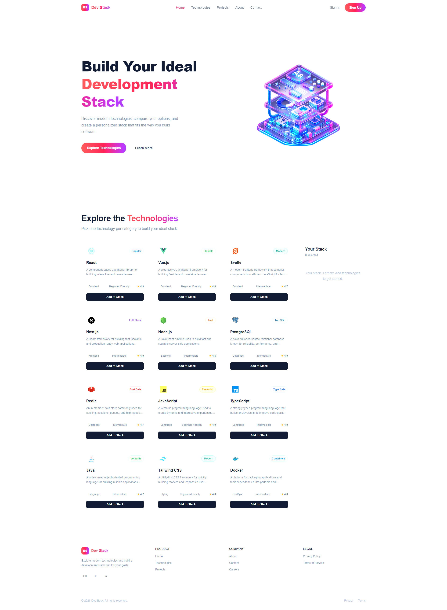

# Dev Stack Builder

Dev Stack Builder is a responsive React and TypeScript web application that helps developers explore modern technologies and create their own personalized development stack.

Users can browse technologies by their details, add technologies to their stack, remove individual technologies, or clear the entire stack.

## Features

* **Explore Technologies** — Browse 12 modern technologies with category, difficulty, rating, description, and technology icons.
* **Build Your Stack** — Add technologies to a personal stack with duplicate prevention, toast notifications, and easy removal.
* **Responsive Interface** — Fully responsive layout with desktop and mobile navigation, technology cards, stack sidebar, and footer.

## Technologies Used

* React
* TypeScript
* Tailwind CSS
* Vite
* React Toastify
* JSON

## React Questions & Answers

### 1. What is JSX? Why does React use it?

JSX is a syntax that allows us to write HTML-like code inside JavaScript or TypeScript. React uses JSX because it makes the structure of UI components easier to understand and write. It also allows us to combine UI structure and JavaScript logic in the same component.

### 2. What is the difference between state and props?

Props are data passed from a parent component to a child component. They are read-only inside the child component.

State is data managed by a component itself. When state changes, React can re-render the component and update the UI.

### 3. What is the useState hook? How do you use it?

`useState` is a React hook used to create and manage state inside a functional component.

For example, in this project, `useState` is used to store the technologies loaded from JSON, the technologies selected in the user's stack, and the loading status.

### 4. What is useEffect? Why is it useful when fetching JSON?

`useEffect` is a React hook that lets us perform side effects after a component renders.

In this project, `useEffect` is used to fetch the technology data from the JSON file when the application loads. This keeps the data-loading process separate from the component's normal rendering logic.

### 5. Why is it important to use a unique key when rendering a list?

React uses the `key` to identify individual items in a list. A unique key helps React understand which items were added, removed, or changed.

Without proper keys, React may have difficulty updating lists efficiently and can show warnings in the console.

### 6. What is conditional rendering? How do you use it in this project?

Conditional rendering means displaying different UI based on a condition.

For example, this project shows an empty-stack message when no technology has been selected. When technologies are added, the selected technology list is displayed instead.

It is also used to change the Add to Stack button into a disabled `Added to Stack` button when a technology has already been selected.

### 7. How can you pass data from a parent component to a child component? How can you pass data from a child to a parent?

A parent component can pass data to a child component through props.

To send information from a child back to its parent, the parent can pass a callback function as a prop. The child can then call that function when an event happens.

In this project, `App` passes technology data and the `onAdd` callback to `TechnologyCard`. When the user clicks the Add to Stack button, the child component calls the callback so the parent can update the selected stack.

## Run Locally

### 1. Clone the repository

```bash
git clone https://github.com/afiaafia/dev-stack-builder-v2.git
```

### 2. Go to the project directory

```bash
cd dev-stack-builder-v2
```

### 3. Install dependencies

```bash
npm install
```

### 4. Start the development server

```bash
npm run dev
```

The application will then be available on the local development server.

## Build for Production

```bash
npm run build
```

## Live Demo

[Live Demo](https://dev-stack-builder-v2.vercel.app/)

## Preview



## License

This project was created for educational purposes.
